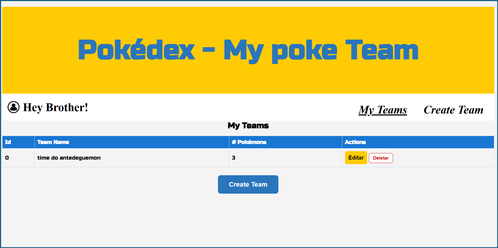

# pokemon
# PokeTeam Challenge


[](LICENSE)  
[](https://seu-projeto.vercel.app)

---

## Descrição do Projeto

Este projeto nasceu de um desafio proposto por um parceiro e seguiu um modelo. 
A aplicação consome a PokeAPI para renderizar todos os Pokémons existentes.  

O objetivo principal é permitir que o usuário:

- crie seu próprio time de Pokémons;  
- modifique e remova membros do time;  
- veja detalhes individuais de cada Pokémon.  

Cada card de Pokémon adota um design dinâmico: dependendo do tipo (fogo, água, planta etc.), aparece um estilo visual diferente, tornando a interface mais atrativa e imersiva.

---

## Demonstração ao Vivo

Confira a versão hospedada no Vercel:  
https://menephylpokedex.vercel.app/

---

## Funcionalidades

- Listagem de todos os Pokémons disponíveis na PokeAPI  
- Filtro por nome ou tipo  
- Visualização detalhada (status, habilidades, estatísticas)  
- Cadastro, edição e remoção de membros do time  
- Design responsivo e cards estilizados por tipo de Pokémon  
- Feedback visual e animações simples para interações

---

## Tecnologias Utilizadas

- JavaScript (ES6+)  
- Verto.js (estrutura de projeto e roteamento)  
- CSS3 com Flexbox e variáveis personalizadas  
- PokeAPI como fonte de dados  
- Vercel para deploy contínuo

---

## Como Executar Localmente

1. Clone o repositório  
   ```bash
   git clone https://github.com/seu-usuario/poketeam-challenge.git

