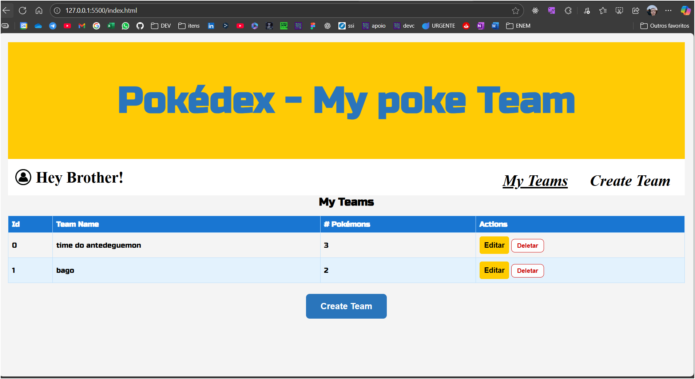
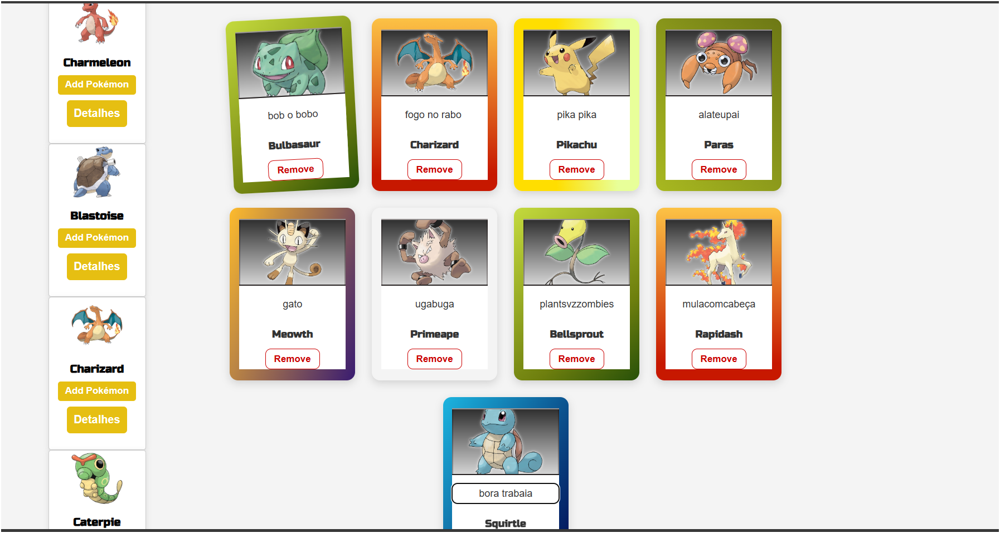

# PokéTeam Challenge

[](LICENSE)  
[](https://menephylpokedex.vercel.app)

---

## 📖 Descrição do Projeto

Este projeto nasceu de um desafio proposto por um parceiro e evoluiu para uma aplicação completa de gerenciamento de times de Pokémon.  
A aplicação consome a **PokéAPI** para renderizar Pokémons e permite ao usuário criar, editar e visualizar seus próprios times.

O objetivo principal é permitir que o usuário:

- Crie seu próprio time de Pokémons  
- Modifique e remova membros do time  
- Veja detalhes individuais de cada Pokémon  
- Defina apelidos customizados para cada Pokémon, exibidos abaixo do nome oficial  


Cada card de Pokémon adota um design dinâmico: dependendo do tipo (fogo, água, planta etc.), aparece um estilo visual diferente, tornando a interface mais atrativa e imersiva.

---

## 🚀 Demonstração ao Vivo

Confira a versão hospedada no Vercel:  
👉 [menephylpokedex.vercel.app](https://menephylpokedex.vercel.app)


---

## ✨ Funcionalidades

### Funcionalidades principais
- Listagem de todos os Pokémons disponíveis na PokéAPI  
- Filtro por nome ou tipo  
- Visualização detalhada (status, habilidades, estatísticas)  
- Cadastro, edição e remoção de membros do time  
- Design responsivo e cards estilizados por tipo de Pokémon  
- Feedback visual e animações simples para interações  

### Funcionalidades extras implementadas
- **Paginação**: botões *Previous* e *Next* para navegar entre páginas da PokéAPI  
- **Validações inteligentes**:
  - Impede salvar time sem nome  
  - Impede salvar time sem Pokémons  
  - Impede adicionar o mesmo Pokémon duas vezes  
- **Renomear Pokémons**: cada card no time possui input para nome customizado  
- **Persistência local**: times salvos no `localStorage`, com redirecionamento automático para destacar o time recém-criado  
- **Modal avançado**:
  - Exibe sprite oficial, stats, habilidades, altura, peso e até gif animado do Pokémon  
  - Fecha ao clicar no “X” ou fora da área  
- **Feedback visual dinâmico**:
  - Gradientes exclusivos por tipo de Pokémon  
  - Primeiro card do time com inclinação especial  
  - Hover em cards e botões com transições suaves  

---

## 📚 Aprendizados

Durante o desenvolvimento, foram aplicados conceitos importantes de:

- **Manipulação de DOM avançada**  
  - Criação dinâmica de elementos (`createElement`, `cloneNode`)  
  - Uso de `dataset` para armazenar metadados  
  - Alternância de classes (`.hidden`) para mostrar/esconder seções  

- **Integração com API REST**  
  - Consumo da PokéAPI com `fetch`  
  - Paginação manual com `limit` e `offset`  
  - Tratamento de erros com `try/catch`  

- **Persistência no navegador**  
  - Armazenamento e recuperação de dados com `localStorage`  
  - Serialização com `JSON.stringify` e `JSON.parse`  

- **UX/UI**  
  - Validações com feedback imediato  
  - Modal interativo para detalhes  
  - Estilização híbrida (CSS + JS dinâmico)  

- **Organização modular**  
  - Separação em múltiplos arquivos JS (`main.js`, `layout.js`, `teams.js`, `createTeams.js`)  
  - CSS dividido em `style.css` (global) e `index.css` (tabela)  

---

## 🛠️ Tecnologias Utilizadas

- **HTML5**  
- **CSS3** (Flexbox, gradientes dinâmicos, responsividade)  
- **JavaScript (ES6+)**  
  - Manipulação de DOM  
  - `fetch` API  
  - `localStorage`  
- **PokéAPI** (fonte de dados)  
- **Sprites animados externos** (Pokémon Showdown)  
- **Google Fonts (Russo One)**  
- **Vercel** (deploy contínuo)  

---

## 📌 Como Executar Localmente

1. Clone o repositório:
   ```bash
   git clone https://github.com/seu-usuario/poketeam-challenge.git

 2  - Acesse a pasta do projeto:
cd poketeam-challenge

3 - Abra o index.html ou execute um servidor estático:
npx serve


4 - Navegue até http://localhost:3000 e comece a usar!


